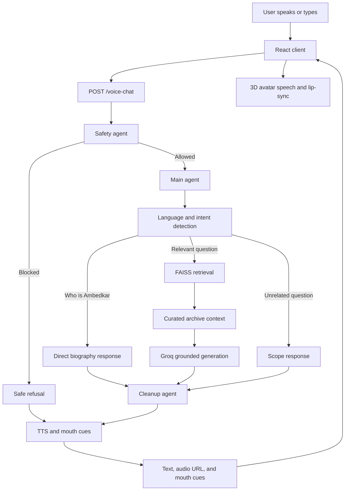

# Dr. B. R. Ambedkar Hologram

An interactive 3D avatar assistant that answers questions about Dr. B. R. Ambedkar using a React frontend, a FastAPI backend, retrieval-augmented generation, multilingual responses, text-to-speech, and lip-sync animation.

## Features

- 3D avatar rendered with React Three Fiber and Three.js
- Voice input through browser speech recognition
- Answers in English, Tamil, and Hindi
- Safety filtering before the main response is generated
- Ambedkar-focused intent classification
- FAISS vector search over the Ambedkar Writings and Speeches archive
- Curated archive context for broad biographical and topic questions
- Groq-powered grounded answer generation
- Piper and other local TTS support
- Mouth-cue generation for avatar lip synchronization
- Conversation history and a clear-history endpoint

## Architecture



## Total Request Flow

1. The user speaks into the browser or submits a question through the React interface.
2. The client sends the message, selected voice, and language preference to `POST /voice-chat` on port `8001`.
3. The safety agent checks the request. Unsafe requests receive a refusal without entering the answer-generation path.
4. The main agent detects the language and classifies the request as identity, relevant, or unrelated.
5. Direct questions such as `who is ambedkar` use a reliable biography response. Other relevant questions continue to retrieval.
6. The RAG retriever embeds the query with `all-MiniLM-L6-v2` and searches the FAISS index for relevant archive chunks.
7. The curated `server/ambedkar_archive.json` is added as supplementary context for broader biographical and subject-area questions.
8. Groq generates a concise answer using only the retrieved and curated Ambedkar material.
9. The cleanup agent removes unwanted formatting and prepares text for speech.
10. The TTS layer creates an audio file and generates mouth cues from the spoken text.
11. The API returns the answer text, audio URL, mouth cues, and source metadata.
12. The frontend displays the answer, plays the audio, and drives the avatar mouth animation from the cues.

## Project Structure

```text
.
├── client/                  React and Vite frontend
│   ├── src/App.jsx          Main UI and voice-chat request flow
│   ├── src/components/      Avatar, speech, and lip-sync components
│   └── public/               Models, textures, and definitions
├── server/                  FastAPI backend
│   ├── main.py              API routes and complete response pipeline
│   ├── agents/              Safety, main, and cleanup agents
│   ├── rag/                 Ingestion and FAISS retrieval code
│   ├── tts.py               Text-to-speech and mouth-cue generation
│   ├── ambedkar_archive.json Curated supplementary reference material
│   └── data/ambedkar/       Metadata, PDFs, and local vector index
├── start.ps1                Starts the backend and frontend on Windows
└── extract_textures.py      Asset preparation utility
```

## Requirements

- Windows PowerShell
- Python 3.10 or newer
- Node.js 18 or newer and npm
- A Groq API key for generated answers
- The Ambedkar PDF archive if rebuilding the vector index

## Setup

### 1. Create the Python environment

```powershell
python -m venv .venv
.\.venv\Scripts\Activate.ps1
pip install -r server\requirements.txt
```

### 2. Install frontend dependencies

```powershell
cd client
npm install
cd ..
```

### 3. Configure the API key

```powershell
Copy-Item server\.env.example server\.env
```

Open `server\.env` and replace `your_groq_api_key_here` with your Groq API key. The `.env` file is ignored by Git and must never be committed.

### 4. Prepare RAG data

The repository ignores the large PDFs and generated vector index. Place the Ambedkar PDFs under `server/data/ambedkar/writings/`, then build the index when needed:

```powershell
.\.venv\Scripts\python.exe server\rag\ingest.py
```

The ingestion script extracts PDF text, creates overlapping chunks, embeds them, and writes `index.faiss` and `chunks.pkl` under `server/data/ambedkar/vectorstore/`.

## Run Locally

From the project root:

```powershell
.\start.ps1
```

Then open `http://localhost:5173`. The backend runs at `http://127.0.0.1:8001`.

To run each service separately:

```powershell
# Backend
cd server
..\.venv\Scripts\python.exe -m uvicorn main:app --host 127.0.0.1 --port 8001 --reload

# Frontend, in another terminal
cd client
npm run dev
```

## API Endpoints

| Method | Endpoint | Purpose |
| --- | --- | --- |
| `POST` | `/voice-chat` | Run safety, answering, cleanup, TTS, and lip-sync generation |
| `POST` | `/mouthCues` | Generate mouth cues for supplied text and duration |
| `POST` | `/clear-history` | Clear the in-memory conversation history |
| `GET` | `/audio/{filename}` | Serve generated audio files |

Example request:

```json
{
  "message": "Who is Ambedkar?",
  "voice": "male",
  "input_lang": "auto"
}
```

## Validation

```powershell
# Frontend checks
cd client
npm run lint
npm run build

# Backend syntax check from the project root
cd ..
.\.venv\Scripts\python.exe -m compileall server
```

## Data and Secrets

Large PDFs, FAISS files, generated audio, virtual environments, dependency folders, and `.env` files are excluded through `.gitignore`. Keep API keys out of source control.

Done by 
Sai Aditiyaa R S
B.E CSE

